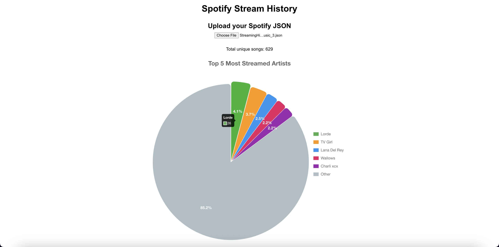

# Spotify Data Visualizer

A React-based web app that visualizes your Spotify listening history. It displays the top 5 most streamed artists using interactive pie charts with percentage labels.

---

## Features

- Upload a Spotify JSON streaming history file.
- Filter out plays under 30 seconds and identify unique songs.
- Display a pie chart of the top 5 artists and group the rest as "Other".
- Interactive chart with legend and percentage labels near the slices.

---
## Screenshot

---
## Technologies

- React
- Chart.js
- JavaScript 
- HTML/CSS
- Git & GitHub

---

## Installation

- Clone the repository

